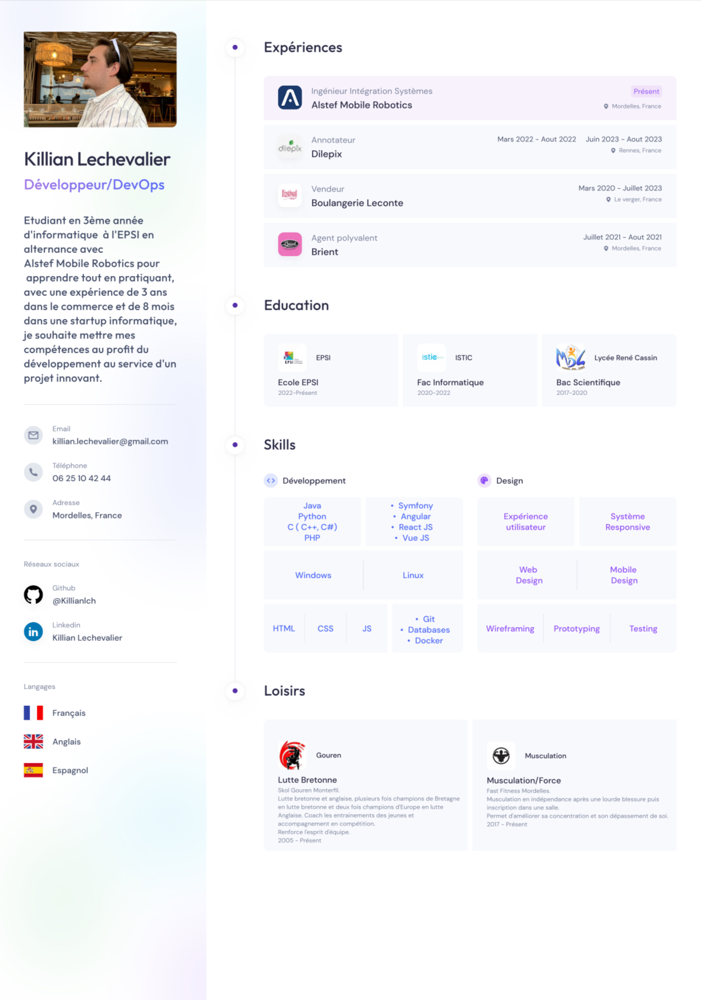

# CV de Killian LECHEVALIER

Bienvenue sur mon CV en ligne ! Ce projet a été développé en HTML et CSS, et est hébergé grâce à GitHub Pages à l'adresse suivante : [https://killianlch.github.io/CV/](https://killianlch.github.io/CV/).

## Aperçu

## Contenu

Ce projet contient les éléments suivants :

- **index.html**: Le fichier HTML principal contenant la structure de la page.
- **style.css**: Le fichier CSS principal contenant les styles appliqués à la page.
- **global.css**: Un fichier CSS contenant des styles globaux pour le site.
- **styleguide.css**: Un fichier CSS contenant les styles spécifiques pour un guide de style, si applicable.
- **img/**: Ce répertoire contient les images ou autres ressources utilisées dans le CV.
- **lettre de motivation/**: Ce répertoire contient les fichiers relatifs à la lettre de motivation.

## Comment visualiser le CV

Vous pouvez consulter mon CV en ligne en suivant ce lien : [https://killianlch.github.io/CV/](https://killianlch.github.io/CV/).

## Lettre de Motivation

La lettre de motivation est désormais intégrée au projet. Vous pouvez la consulter dans le répertoire "lettre de motivation".

## Comment contribuer

Si vous avez des suggestions d'amélioration pour mon CV ou si vous avez repéré un bug, n'hésitez pas à ouvrir une issue ou à soumettre une pull request.

## Licence

Ce projet est sous licence [MIT](LICENSE).

---

N'hésitez pas à me contacter si vous avez des questions ou des commentaires !
